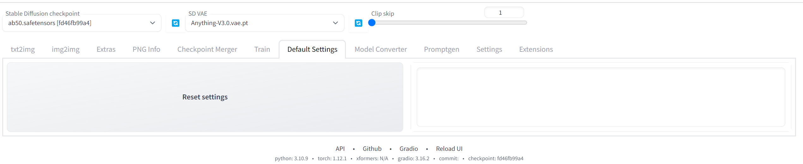
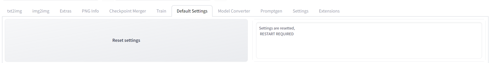
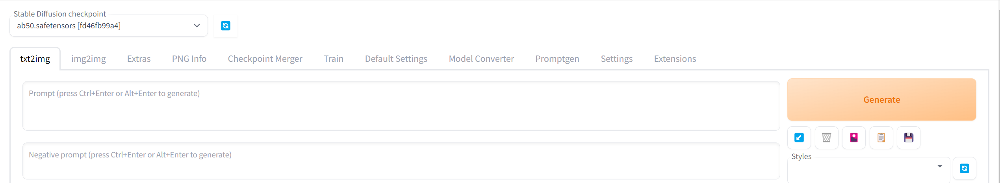

# Reset to default settins
This extension allows you to revert to the default settings of
Automatic1111 Stable's Webui [AUTOMATIC1111's stable-diffusion-webui](https://github.com/AUTOMATIC1111/stable-diffusion-webui)

## Additional Info:

### How does this work?
This is how my customized UI looks like.
You first go to the tab called Default settings

You press the button Reset settings and afterwards
this appears in the textbox :
> 'Settings are resetted, RESTART REQUIRED'

Which means ,it worked, you need to restart the Webui.

>The webui looks like this after the restart:
> 

## additional info
If for some reason you don't like the look
of the default webui , you can always go back.
place the config.json and ui-config.json located in
> /extensions/Reset-to-default-settings/scripts

